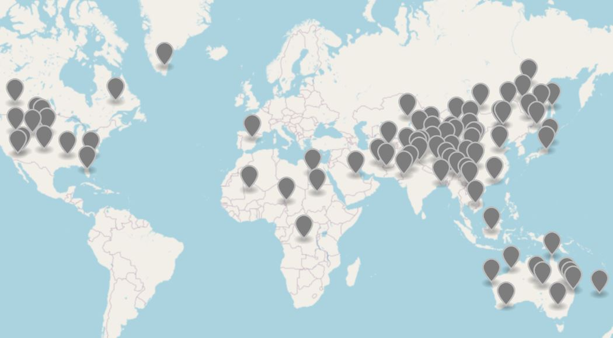
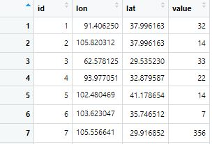
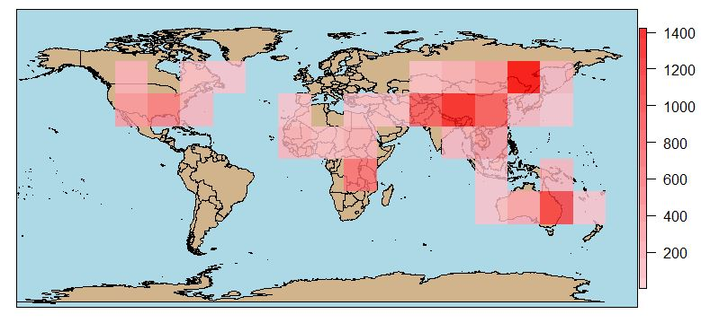
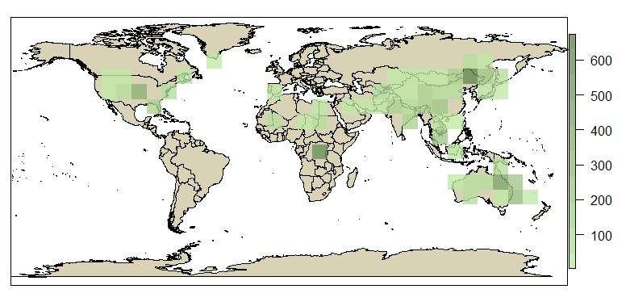

# quickgeo

This R package can perform quick zonal statistics for point data across a continent or the globe.

The <code>zonal_stat()</code> function can return a raster data file (S4 object) of the statistics result and plot a map for exploratory analysis.

Supported statistics include min, max, median, mean, sum, var, and sd.

Installation:
install_github('yeshancqcq/quickgeo')

If the <code>Error in as.double(y) : cannot coerce type 'S4' to vector of type 'double'
</code> error occurs, update the <code>sp</code> package in R.

Type <code>?zonal_stat </code> in the terminal of RStudio to see descriptions of arguments, data requirments, and the example.

## Example:

Raw data distribution

 
 
Import the point data into R

 
 
Calculating the sum of values within each zone (resolution = 20), and get the result

<code> zonal_stats(df, res= 20, level = 15, label = "", map=T, stat=sum) </code>

 
 
 Or, calculating the mean of values with a finer resolution (10) and customize the map
 
 <code>zonal_stats(df, res= 10, level = 10, land_color = "#d9d2b6" ,marine_color = "white", color_ramp = c("#c0e8a7", "#678752"), label = "", map=T,stat=mean)</code>
 
  

