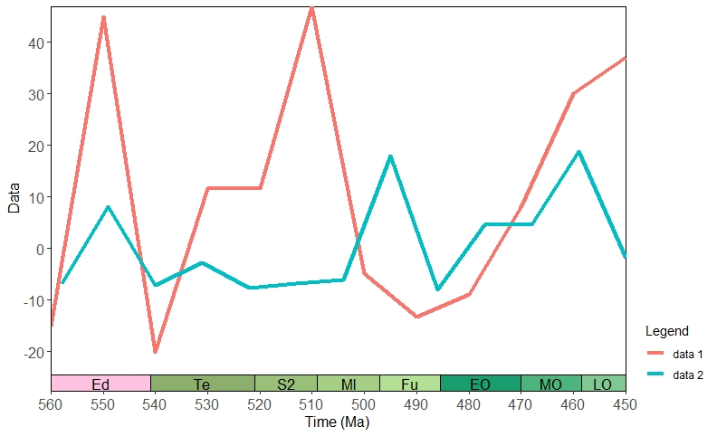
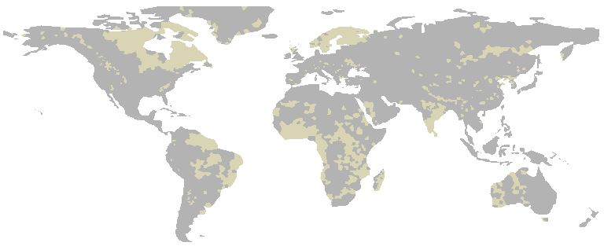
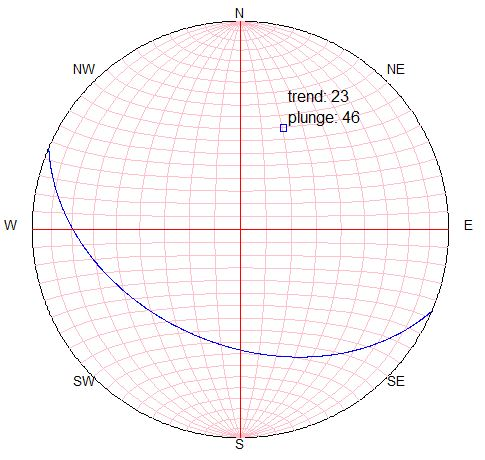

# quickgeo

This R package is for quick plots of geological and climatological data with spatial and/or temporal components for exploratory analysis.

More functions will be gradually added in the future.

## Installation
    install_github('yeshancqcq/quickgeo')

## Functions
### Zonal statistics

The <code>zonal_stat()</code> function can perform quick zonal statistics for point data across a continent or the globe.

It returns a raster data file (S4 object) of the statistics result and plot a map for exploratory analysis.

Supported statistics include min, max, median, mean, sum, var, and sd.

If the <code>Error in as.double(y) : cannot coerce type 'S4' to vector of type 'double'
</code> error occurs, update the <code>sp</code> package in R.

Type <code>?zonal_stat </code> in the terminal of RStudio to see descriptions of arguments, data requirments, and the example.

##### Example

Raw data distribution

 

Import the point data into R

 

Calculating the sum of values within each zone (resolution = 20), and get the result

     zonal_stats(df, res= 20, level = 15, label = "", map=T, stat=sum)

 

 Or, calculating the mean of values with a finer resolution (10) and customize the map

    zonal_stats(df, res= 10, level = 10, land_color = "#d9d2b6" ,marine_color = "white", color_ramp = c("#c0e8a7", "#678752"), label = "", map=T,stat=mean)

  

### Geological time scale on the axis

The <code>geotime_axis()</code> function can add a geological time scale to the axis of a plot. It is good for time series visualization.

This is an extention to a ggplot object. The time series can be at different levels including eon, era, period, epoch, and age.

Labels can be added as abbreviations or full names of each time interval. It can also be hiden.

Colors of each interval are retrieved from the [Macrostrat API](https://macrostrat.org/#api).

It is flexible with various ggplot customizations.

##### Example

    x = c(seq(450,650,10))
    y = c(runif(21, -30, 50))
    plot <- ggplot() +
      geom_line(aes(y = y, x = x, color = "data 1"), size = 1.5) +
      geom_line(aes(y = y*0.4, x = x*0.9, color = "data 2"),size = 1.5) +
      labs(y = "Data",
          x = "Time (Ma)",
          color = "Legend")
          p <- geotime_axis(plot, age_min = 450, age_max = 560,level = "epoch", label = "abbr", div_x = 10)
      p

and the result is:

  

### Quick check the bedrock coverage

The <code>bedrock()</code> function allows you to quickly plot a schematic map shouwing the bedrock coverage of a given age.

There are 3 arguments and the later 2 of them are optional. The first and second arguments are numeric indicating the age (duration, if the second is used) to be checked (in Ma). The third argument indicates the method of overlapping the time intervals. When "partial" is passed (which is the default), a bedrock area would be shown on the map if its age range intersects with the  input age interval. If "entire" is chosen, then the map only shows bedrock areas whose age range is entirely within the given interval.

##### Example

    bedrock(1000,3000)

This will plot the bedrock areas between 1000 and 3000 Ma. Because the third argument is unused, the default setting will apply ("partial").

The result is:

  

Bedrocks from this period is in light color.

### Stereograph
The <code>stereograph()</code> function can generate a stereograph from a pair of strike and dip data. The 2 arguments are strike and dip in degrees.

    bedrock(113,44)

  

Bedrocks from this period is in light color.
